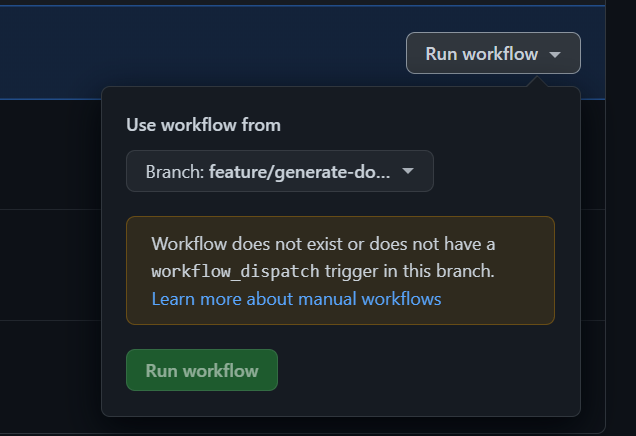

# Scalingo-cli-ci

## À propos

Image docker de la cli scalingo en vue d'une intégration CI.
contient aussi le nécessaire pour générer des clefs ssh à usage unique pour les déploiments

## Setup repository variables
DOCKERHUB_USERNAME 
DOCKERHUB_TOKEN => [to generate an access tolen follow these instructions ~5min](https://docs.docker.com/docker-hub/access-tokens/)

### TO DOCUMENT

:warning Do NOT put a comment between two instruction on a multiline script, the yaml validation will not fail but you'll have this not explicit error when trying to run your workflow.

### TODO
- mettre en place un workflow de build de l'image docker et de et push sur dockerhub (ref ?: https://docs.docker.com/ci-cd/github-actions/ )
- tagger avec la version de release de scalingo-cli

- Améliorer l'interaction avec l'api gh en filtrant le retour curl en json avec jq (https://stackoverflow.com/questions/62595453/filtering-from-json-output-from-curl-using-jq)
  Objectif obtenir le "browser_download_url" du champ 'assets' qui à le 'name' qui contient la 'target_architecture'

